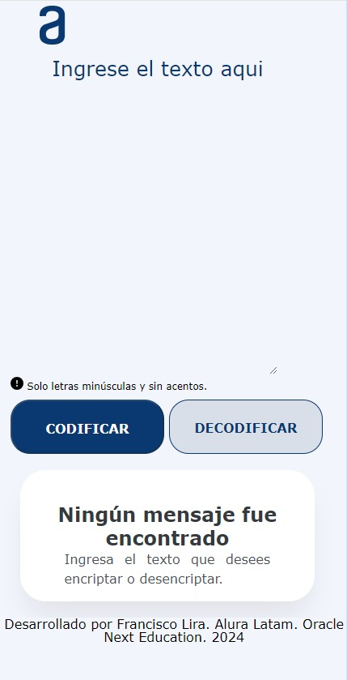

<h1>Encriptador de Texto</h1>

-Estado del proyecto: En construcción.
-HTML finalizado
-CSS finalizado
-JS finalizado

- Encriptador y desencriptador de texto con boton de copiar campo. 

- Proyecto finalizado

<h2> Vista escritorio </h2>

- Estado inicial

- Encriptar

- Copiar

<h2> Vista dispositivo movil</h2> 

- Estado inicial

- Encriptar

- Copiar

